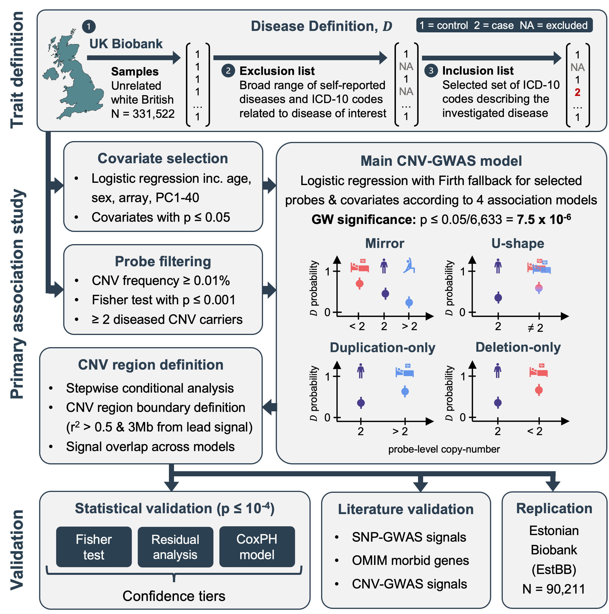

# CNV-GWAS on common diseases (binary traits)
Code repository for *"Rare copy-number variants as modulators of common disease susceptibility"*

DOI: 10.1186/s13073-023-01265-5 (https://genomemedicine.biomedcentral.com/articles/10.1186/s13073-023-01265-5)

**Contact:** Chiara Auwerx (chiara.auwerx -at- unil.ch) or Zoltan Kutalik (zoltan.kutalik -at- unil.ch).

**Summary:** Copy-number variations (CNVs) have been associated with rare and debilitating genomic disorders (GDs) but their impact on health later in life in the general population remains poorly described. Assessing four modes of CNV action, we performed genome-wide association scans (GWASs) between the copy-number of CNV-proxy probes and 60 curated ICD-10 based clinical diagnoses in 331,522 unrelated white British UK Biobank (UKBB) participants with replication in the Estonian Biobank. We identified 73 signals involving 40 diseases, all of which indicating that CNVs increased disease risk and caused earlier onset. We estimated that 16% of these associations are indirect, acting by increasing body mass index (BMI). Signals mapped to 45 unique, non-overlapping regions, nine of which being linked to known GDs. Number and identity of genes affected by CNVs modulated their pathogenicity, with many associations being supported by colocalization with both common and rare single-nucleotide variant association signals. Dissection of association signals provided insights into the epidemiology of known gene-disease pairs (e.g., deletions in *BRCA1* and *LDLR* increased risk for ovarian cancer and ischemic heart disease, respectively), clarified dosage mechanisms of action (e.g., both increased and decreased dosage of 17q12 impacted renal health), and identified putative causal genes (e.g., *ABCC6* for kidney stones). Characterization of the pleiotropic pathological consequences of recurrent CNVs at 15q13, 16p13.11, 16p12.2, and 22q11.2 in adulthood indicated variable expressivity of these regions and the involvement of multiple genes. Finally, we show that while the total burden of rare CNVs—and especially deletions—strongly associated with disease risk, it only accounted for ~ 0.02% of the UKBB disease burden. These associations are mainly driven by CNVs at known GD CNV regions, whose pleiotropic effect on common diseases was broader than anticipated by our CNV-GWAS. Our results shed light on the prominent role of rare CNVs in determining common disease susceptibility within the general population and provide actionable insights for anticipating later-onset comorbidities in carriers of recurrent CNVs.

## Workflow overview:

 **Figure 1:** Schematic representation of the analysis workflow. Trait definition: For each of the 60 investigated diseases, unrelated white British UK Biobank participants were assigned as controls, individuals self-reporting or diagnosed with the disease of interest or a broader set of related conditions were excluded and set as missing, and individuals with a hospital-based ICD-10 diagnosis of the condition of interest were re-introduced as cases. Primary association study: Disease-specific relevant covariates were selected. Probes were pre-filtered based on copy-number variant (CNV) frequency, required to associate with the disease, and a minimum of two diseased carriers was required for the probe to be carried forward. Disease- and model-specific covariates and probes were used to generate tailored CNV genome-wide association studies (GWASs) based on Firth fallback logistic regression according to a mirror, U-shape, duplication-only (i.e., considering only duplications), and deletion-only (i.e., considering only deletions) models. Independent lead signals were identified through stepwise conditional analysis and CNV regions were defined based on probe correlation and merged across models. Validation: Statistical validation methods (i.e., Fisher test, residuals regression, and Cox proportional hazards model (CoxPH)) were used to rank associations in confidence tiers. Literature validation approaches leverage data from independent studies to corroborate that genetic perturbation (i.e., single-nucleotide polymorphisms (SNP), rare variants from the OMIM database, and CNVs) in the region are linked to the disease. Independent replication in the Estonian Biobank.

## Description of content: 

- **01_samples:** Selection criteria for samples used in the analyses.

- **02_probes:** Broad (non disease-specific) selection criteria for probes used in the analyses, including filtering on CNV frequency (≥ 0.01%) and pruning. This folder also contains scripts to calculate the number of effective tests used to determine the genome-wide threshold of significance after correction for multiple testing.

- **03_covariates:** Extract covariate data.

- **04_phenotypes:** Define cases and controls according to predefined inclusion and exclusion lists (see Table S1 of the manuscript) and encode the data in a PLINK-compatible format. The folder also contains scripts to estimate the prevalence of the studied diseases and determine the earliest age at diagnosis for each case.    

- **05_gwas:** Tailored common disease CNV-GWASs.
  - `01_batch_effect`: Test whether genotyping batches associate with disease risk. As associations were driven by the genotyping array and not the genotyping batch, only genotyping array was available for selection at the next step, `02_covariate_selection`. 
  - `02_covariate_selection`: For each disease, covariates among age, sex, genotyping array, and principal components (PCs) 1-40 that affect disease risk at p ≤ 0.05 are retained for inclusion in the main GWAS models.
  - `03_probe_selection`: Among pre-filtered probes (see **`02_probes`**), retain those that associate with disease risk (genotypic 2x3 Fisher test p ≤ 0.001). At least 2 diseased individuals with a probe-level CNV, duplication, or deletion are required for the probe to be tested through the mirror/U-shape, duplication-only, or deletion-only association models in the main GWAS models. 
  - `04_gwas`: GWASs according to four association models using disease- and model-specific probe and covariate combinations. The folder also contains scripts to harmonize summary statistics and retain genome-wide significant signals.
  - `05_pruning`: Prune genome-wide significant signals prior to the stepwise conditional analysis (SCA).       

- **06_SCA:** Stepwise conditional analysis (SCA) allowing to identify independent associations. 

- **07_CNVR:** Define CNV regions for each independent genome-wide significant signal from the SCA based on correlation structure in the data, in a model-specific fashion. In `combined`, signals are overlayed across models and validated with 3 statistical approaches (i.e., Fisher test, residual analysis, Cox regression (i.e., time-to-event analysis)) to define statistical confidence tiers. Unique CNV regions are identified by overlaying independent associations that map to overlapping genetic regions. 

- **08_ANNOVAR:** Annotation of unique CNV regions with genes (inc. OMIM morbid genes) and overlap with 131 continuous trait CNV-GWAS associations from [Auwerx et al., 2022](https://pubmed.ncbi.nlm.nih.gov/35240056/).    

- **09_burden_analysis:** Association between various measures of the CNV burden and disease risk (inc. disease burden). This folder also contains scripts to compare the relative contribution of the deletion or duplication burdens measured in number of affected Mb, as opposed to the one measured in number of disrupted genes.   

- **10_candidates:** Scripts related to specific examples detailed in the manuscript, to obtain association data for all probes in a specified genetic region (i.e., locus zoom) or perform time-to-event analysis with specific disease definitions. 

*Note:* Scripts are ordered and often rely on data generated by previous scripts. They have been annotated to described which script produces files required for a given analysis.

## Data availability: 

Key data are made available as supplementary tables of the manuscript. Summary statistics can be downloaded from the GWAS Catalog under the study accession numbers: GCST90297568-GCST90297771.
